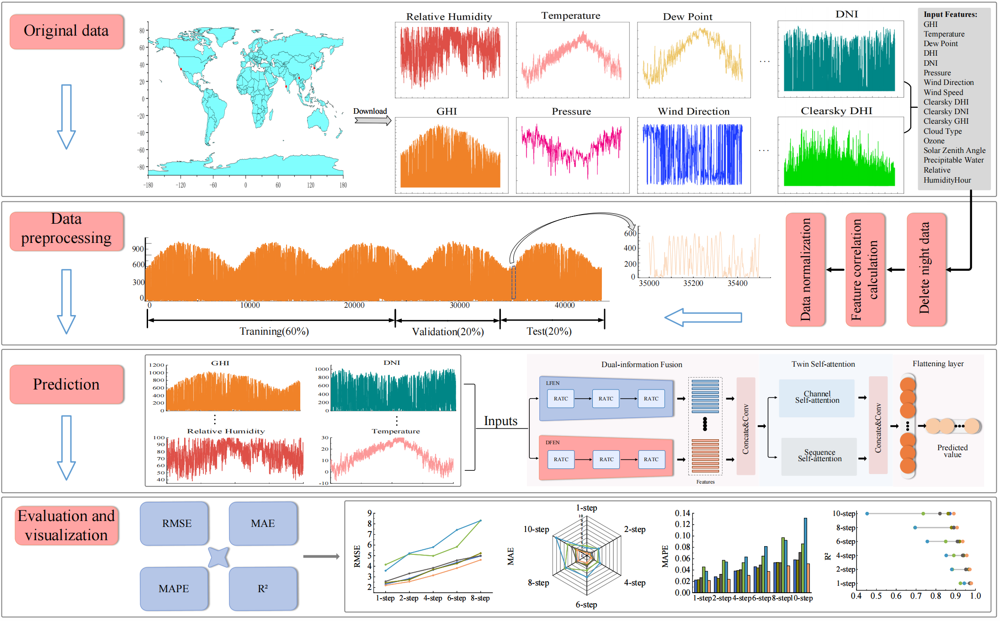

# DTNet
Dual-Path Information Fusion and Twin Attention Driven Global Modeling for Solar Irradiance Prediction

## Architecture of the proposed framework

## Environment

## Installation

   
   
## Acknowledgments

